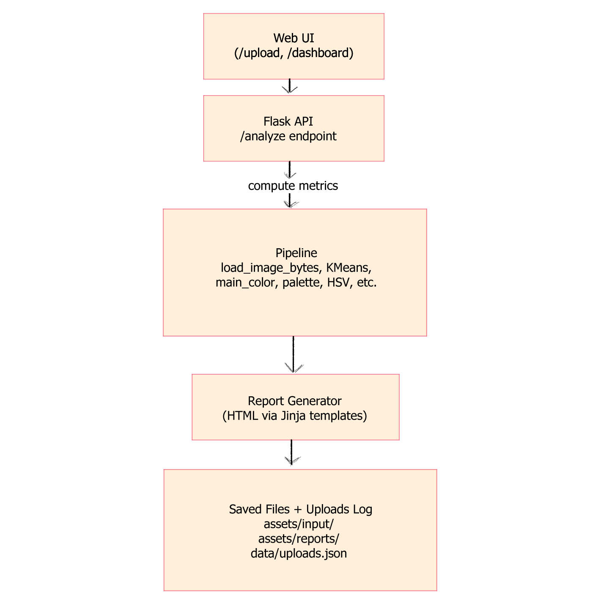
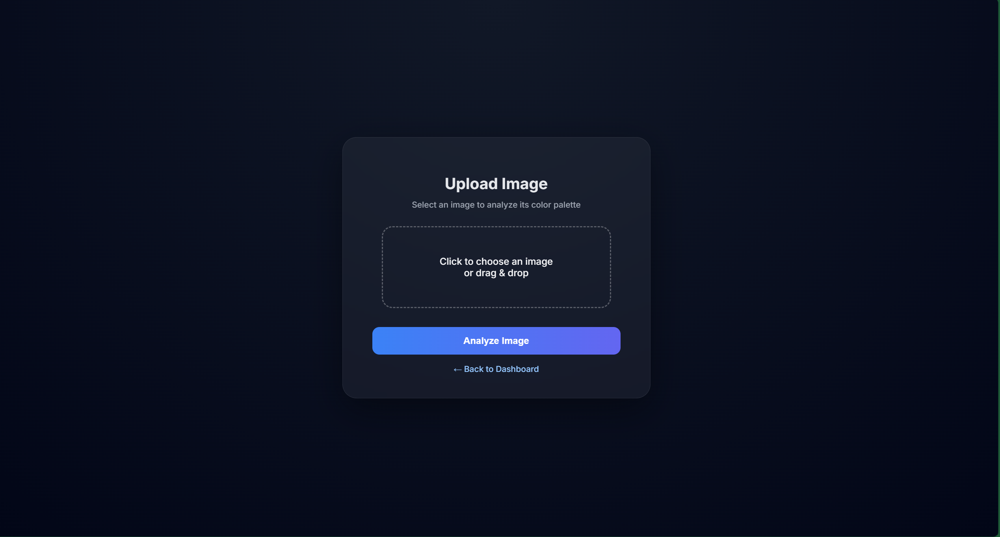
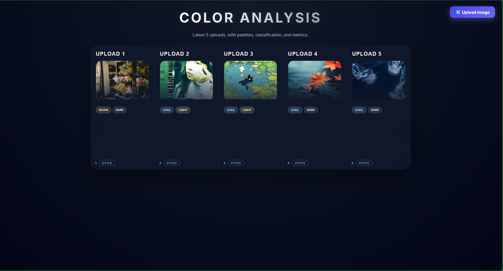
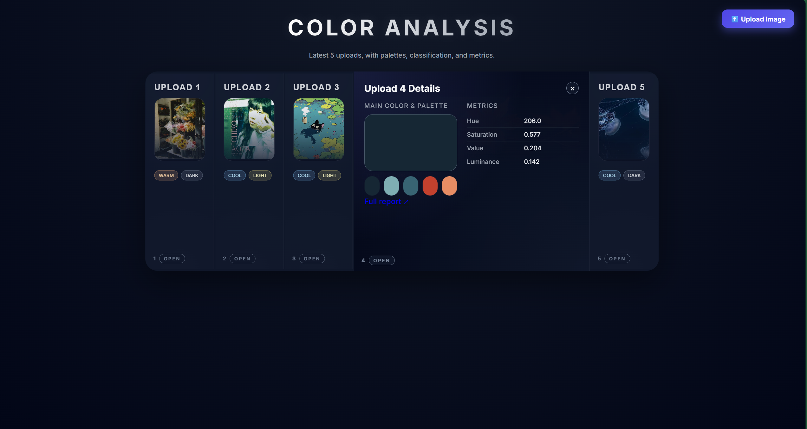

# Case-Study Write-Up

## 1. Executive Summary
**Problem**: Artists, designers, and digital creators often need a quick, automated way to extract a color palette and basic mood characteristics (light/dark, warm/cool) from reference images. Manually doing this in tools like Photoshop is slow and time consuming.

**Solution**: Color Analyzer is a fully containerized Flask application that accepts an uploaded image, processes it through a custom color-extraction data pipeline, generates a detailed HTML color-analysis report (extracts a palette using K-Means, determines the main color, computes HSV/luminance features, classifies the image temperature (warm/cool) and brightness (light/dark)) and updates a dashboard showing the five most recent analyses.

## 2. System Overview 
**Course Concepts(s)**: Data Pipeline, Flask API, Docker Containerization, Logging & Metrics

**Architecture Diagram**: 

**Data/Models/Services**: 

- Input: user-uploaded images (JPG/PNG)
- Pipeline: Pillow, NumPy, sklearn KMeans
- Output: HTML dashboard + Jinja templates
- No external services or ML models required
- Licenses: All libraries are open-source and MIT licensed, no external datasets or APIs.

## 3. How to Run (Local) 

```bash
# Build
docker build -t color-analyzer .

# Run
docker run --rm -p 8080:8080 color-analyzer

# Health check
curl http://localhost:8080/health

```

## 4. Design Decisions
**Why this concept?**: I chose to implement a data pipeline with Flask API because this course module suits supports turning raw data into structured transformations and a service endpoint. 

**Tradeoffs**: 
- Using KMeans is simple and fast but not perceptually perfect.
- Using HTML reports is lightweight but not strongly typed like JSON
- Storing uploads in JSON is easy but not scalable for thousands of images

**Security/Privacy**: 

- No PII stored
- No external uploads
- All data stays local
- Docker container isolates environment

**Ops**: 

- All analyses logged in uploads.json
- Flask debug mode off in production
- Dashboard shows only last 5 analyses
- In Docker, image folders must be writable (permissions considered)

## 5. Results & Evaluation

**Screenshots**





**Testing**

Included smoke tests that cover API health endpoint, dashboard renders, and upload log file creation.

How to run tests:

```bash
pytest -q

```

How to reset dashboard:
```bash
echo "[]" > data/uploads.json

```


## 6. What's Next?
- PDF or image export of reports
- Add more metrics such as color contrast and white/black balance
- User accounts to save history
- Public deployment + CI workflow
- Delete button for specific uploads

## 7. Links (Required)
GitHub Repo: https://github.com/yxqin06/color-analyzer-dashboard

Cloud Deployment: soon
